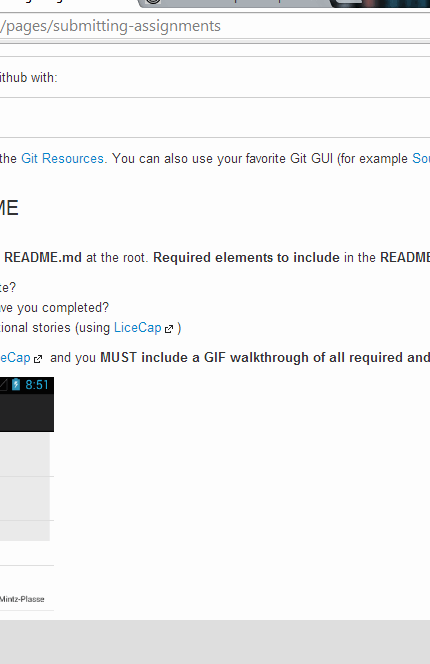

# Android boot camp week 1 - TipCalc

Android demo to calculate a tip amount. 
Requirements at https://canvas.instructure.com/courses/808679/assignments/2375169

Time spent: about 6 hours

Completed user stories:

 * [x] Required: User is displayed the tip of specified percentage for specified entered amount
 * [x] Required: User enters the total amount of the transaction
 * [x] Required: User can select between tip amounts (i.e 10%, 15%, 20%)
 * [x] Required: Upon selecting tip amount, formatted tip value is displayed
 * [x] Optional: User changes the total amount and updated tip is reflected automatically
 * [x] Optional: User can select custom tip percentage if desired
 * [x] Optional: Improve the user interface and experience by using ~~images~~ and/or colors; the button with the current tip amount is highlighted yellow.
 
Notes:
Time includes 1 hour spent fixing bugs, and 1 hour to stabilize environment on Eclipse/ADT

Walkthrough of all user stories:

GIF created with [LiceCap](http://www.cockos.com/licecap/).

